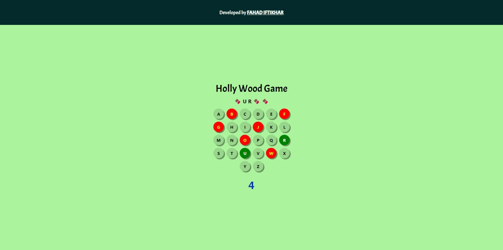

# Hollywood Game

**Hollywood Game** is a fun and interactive word-guessing game built using HTML, CSS, and JavaScript. This project is inspired by the classic hangman-style game and allows players to test their knowledge of movie-related words and phrases.



## Features

- **Dynamic Gameplay**: Players guess letters to form a word or phrase related to Hollywood movies.
- **Visual Feedback**: Incorrect guesses lead to visual updates, making the game engaging.
- **Customizable Themes**: Modify styles easily with the provided CSS.
- **Interactive Design**: Simple and responsive UI, ensuring a seamless experience across devices.

## Download Game for Android

- Download package from release folder
```
./release/android.apk
```
- This game is packed in apk file with the help of https://webintoapp.com
```
https://www.webintoapp.com/store/475618
```

## Technologies Used

- **HTML**: For structuring the game layout.
- **CSS**: For styling and enhancing the visual appeal.
- **JavaScript**: For game logic and interactivity.

## Installation

To get started with the project:

Clone the repository:

```bash
git clone https://github.com/Fahad090NP/HollyWoodGame.git
```
